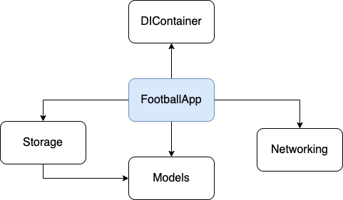
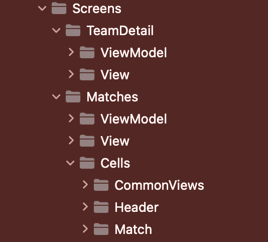
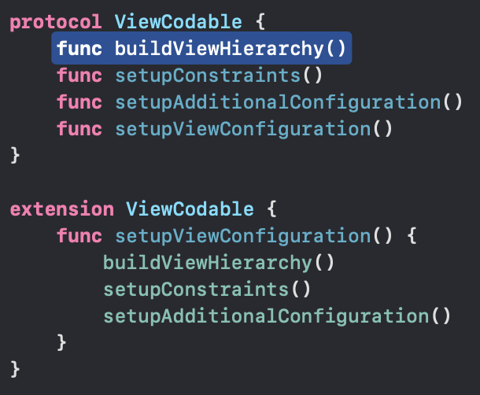
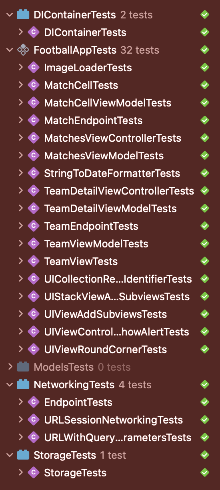

# FootballApp

Football app is an iOS app written in Swift that shows matches (previous and upcoming), team details and match highlights.

* Display Previous and Upcoming Matches:

* Team for team details and filter matches by team:

* Watch highlights of a previous match.

## Features

* [x] Display previous and upcoming matches;
* [x] Select a team for team details;
* [x] Filter matches by team(s);
* [x] Watch highlights of a previous match.

## Coding Requirements

* [x] Use UIKit and Combine (functional reactive programming);
* [x] Build the entire project’s UI programmatically;
* [x] Present lists using collection view diffable data source;
* [x] Following MVVM design pattern, discern files using the feature-first approach;
* [x] Integrate Core Data to sync matches and teams for offline access;
* [x] Conform to API Design Guidelines (https://bit.ly/3ZqnUXO);
* [x] Conform to Swift Style Guide (https://bit.ly/3YicMuO).

## Coding Requirements (Bonuses)

* [x] Encapsulate business/UI logic with Swift Package(s);
* [x] Integrate unit testing bundle with appropriate unit tests for code coverage;
* [x] Integrate unit testing bundle with snapshot tests for UI components comparisons;
* [ ] Integrate UI testing bundle with appropriate UI tests to simulate user interactions;
* [x] Limit third-party dependencies (zero is the best).

## Structure

In order to structure this application to be scalable, a workspace with five projects was created, each one managing a specific concern of the entire application.

* `FootballApp`: Main module of the project. Contains all application screens and a link to all other modules;
* `DIContainer`: Define methods used by other modules that make tasks like persistence and networking decoupled;
* `Models`: Contains value-type oriented entities used by the other modules;
* `Storage`: Abstracts data persistence by exposing an interface that allows, for instance, to create an in-memory database;
* `Networking`: abstracts the networking functionality, exposing a generic interface for making requests.

## Architecture 

MVVM (*Model-View-ViewModel*) was the chosen architecture for this project, since it helps to avoid large ViewControllers with multiple responsibilities and it works well with Combine.

## UI Development

For the development of the project's interface, UIKit was chosen using the ViewCode approach. The ViewCode was chosen because:

* Allows better reuse and componentization; 
* Allows better control over the startup flow.

## Tests

So far, 39 automated tests (unit tests and snapshot tests) have been created for this project:

## Dependency Manager

The Swift Package Manager was used to manage the project's dependencies, allowing code reuse. This project has only one dependency (only for the `Test Target`):

* [SnapshotTesting](https://github.com/pointfreeco/swift-snapshot-testing): Framework used to perform snapshot tests;

## Challenge

Although I'm experienced with UIKit, before this project, I barely had experience with Combine and actual no experience using UICollectionViewDiffableDataSource to present lists. The way I've tackled this challenged was: reading the documentation to understand why these frameworks/approachs exist and what are their benefits. But, of course, I couln't read all the documentation in time (and that probably wouldn't be a good way to spend my time), so I've decided to read tutorials and then I applied what I've learned on a smaller project. After that it was a matter of adapting what I had applied on the smaller project on this projetc and that took couple of tries until I fully understood it and it was working. I was able to learn a lot about reactive programming from this experience and I really liked the way is suits well MVVM.